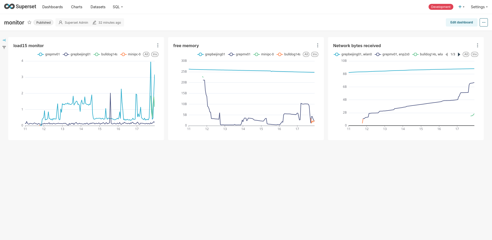

# greptimedb-sqlalchemy


SQLAlchemy and Superset connector for
[GreptimeDB](https://github.com/greptimeteam/greptimedb).



## Superset

If you are using docker to run superset, add this library to
`docker/requirements-local.txt`

```bash
echo "greptimedb-sqlalchemy" > docker/requirements-local.txt
```

Start superset using `docker compose -f docker-compose-non-dev.yml up` you will
be able to add GreptimeDB as a database.
